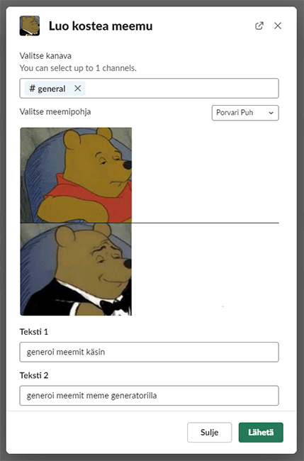
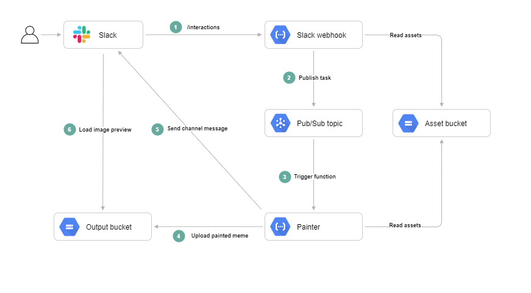

# Meme generator slackbot

Generates image memes on demand.

## Structure

Meme generator consists of three packages:

- `meme-generator-slack-webhook`: Responds to interactions from Slack
- `meme-generator-painter`: Paints meme pictures and posts them to Slack
- `meme-generator-common`: Common utilities shared between the two other packages

## Setup

### Step 1: Slack

- Create a new Slack app
- Generate signing secret ("Settings" -> "Basic Information")
- Setup OAuth permissions ("Features" -> "OAuth & Permissions")
  - Add `chat:write` and `chat:write.public` scopes
  - Install the app to workspace (Click "Install to Workspace")
- Install app to workspace

### Step 2: Github

- Add the signing secret and bot user OAuth access token to Github secrets
- Deploy with GitHub actions

### Step 3: Slack

- Enable interactivity ("Features" -> "Interactivity & Shortcuts" -> "Interactivity").
  - Set "Request URL" to `<SLACK_WEBHOOK_TRIGGER_URL>/interactions`.
- Create a new shortcut ("Features" -> "Interactivity & Shortcuts" -> "Shortcuts")
  - Set location to "Global"
  - Fill in name and description
  - Set "Callback ID" to `GENERATE_MEME`
- Re-install the app to workspace
